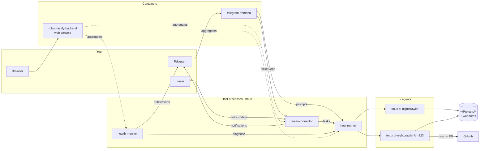
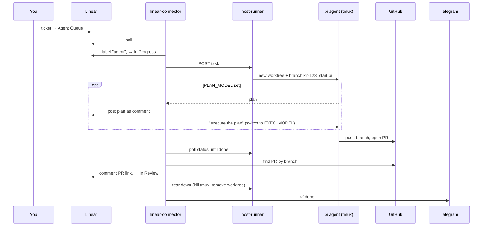

# Robot Mill

Robot Mill is a self-hosted "agent factory". It runs the
[pi coding agent](https://github.com/badlogic/pi-mono) against the real repos
on a home server, so you can hand work to an AI agent from your phone and come
back to a pull request.

You give it work in one of two ways:

- **File a Linear ticket.** Move it to **Agent Queue** and an agent picks it
  up, works in its own git worktree, and opens a PR. The ticket moves to
  **In Review**. Ops tickets work differently: they run a project's runbook
  (deploy, maintenance) and open no PR.
- **Chat in Telegram.** Point a chat at a project (`/project nightcrawler`)
  and everything you type goes to a live agent working in that repo.

A small web console shows what's running, and a health monitor checks your
other self-hosted projects every day and asks a cheap model to diagnose
anything that breaks.

## Architecture



The core rule: **only the host-runner starts agents.** Every other component
asks it to. Agents run as plain host processes inside tmux, so they get full
access to the machine: files, `docker compose`, other projects' scripts. You
can `tmux attach -t pi-<key>` and watch or steer any of them yourself.

### Components

| Component | Runs as | What it does |
|---|---|---|
| **host-runner** | host, tmux | Owns every pi agent. Starts one per key in its own tmux session (`pi-<project>` for chats, `pi-<project>-<issue>` for tickets), creates git worktrees for code tickets, and exposes an HTTP + WebSocket API to send prompts and stream output. |
| **linear-connector** | host, tmux | The way autonomous work comes in. Polls Linear for queued tickets, works out the target repo, dispatches the task to the host-runner, tracks it until it finishes, then updates the ticket and sends a Telegram notification. |
| **health-monitor** | host, tmux | Runs deterministic health checks on your self-hosted projects every day (their `scripts/health-check.sh` or `docker compose ps`, plus your OpenRouter balance). When a check fails, it starts one diagnosis run on a cheap model that tries a safe fix. |
| **telegram-frontend** | container | The Telegram bot. Sends chat messages to a project's agent, files Linear tickets, and lists running agents. |
| **robot-fastify-backend** | container | Serves the web console and homepage, pulling status from the three host components. It also contains an experimental "variations" feature that stays off unless `VARIATIONS_ENABLED=true` (UI in `web-variations-frontend`). |

The agent-facing components run on the host, not in Docker, because the
agents need the real machine. The user-facing ones are containerized and reach
the host over `host.docker.internal`.

## How a ticket flows



- **Which repo?** The ticket's Linear project name, or one of its labels, must
  match a directory in `~/Projects` (limited by the host-runner's
  `ALLOWED_PROJECTS`). If nothing matches, the ticket is moved to
  **Agent Failed** with a comment saying so.
- **Code tickets** run in a fresh worktree off the default branch and end in a
  PR, which moves the ticket to **In Review**.
- **Ops tickets** (label `ops`) run in the project's main checkout, follow that
  project's `AGENTS.md` runbook, never branch or open a PR, and move the
  ticket to **Done**.
- **Failures** (agent crashed, hit the 2h timeout, or the host-runner was
  unreachable) move the ticket to **Agent Failed**. To retry, move it back to
  **Agent Queue**.
- **Restarts are safe.** When the connector restarts, it picks up tracking any
  ticket that is still **In Progress**.

## Using it

### Telegram

Any message that isn't a command goes to the chat's current project as a
prompt.

| Command | Description |
|---|---|
| `/project <name>` | Route this chat to a host project |
| `/ticket <project> <title>\n<description>` | File a Linear code ticket (the agent opens a PR) |
| `/ops <project> <title>\n<description>` | File a Linear ops ticket (runbook, no PR) |
| `/agents` | Running project agents, active Linear tasks, and this chat's project |
| `/abort [KIR-123]` | Abort a Linear task, or this chat's project agent if no ID is given |
| `/new` | Start a fresh conversation in the same pi process |
| `/stop` | Stop this chat's project agent |
| `/poll` | Check Linear now instead of waiting for the next poll |

### Web console

`http://<host>/` (also `:3100/console`) has three tabs: a media-services
dashboard, the **robot mill** view (running agents with a prompt box per
project, active tickets, system status), and a nightcrawler landing page.

### Watching an agent

```sh
tmux ls                          # pi-* sessions are agents, robot-mill-* are the components
tmux attach -t pi-nightcrawler   # watch or type into one directly
```

## Setting it up on a new machine

These steps assume a Linux box that stays on (the reference host is `peeper`,
see [`DEPLOYMENT_NOTES.md`](DEPLOYMENT_NOTES.md)).

### 1. Install prerequisites

- `git`, `tmux`, Docker or Podman with Compose
- [Bun](https://bun.sh): `curl -fsSL https://bun.sh/install | bash`
- pi: `bun install -g @earendil-works/pi-coding-agent@0.87.1` (this puts `pi`
  in `~/.bun/bin`, which the start scripts add to `PATH`)
- SSH or HTTPS git access to your repos, with a git identity configured

### 2. Lay out the directories

```sh
mkdir -p ~/Projects ~/.envs/robot-mill ~/robot-mill
git clone <this repo> ~/Projects/robot-mill
# clone every repo you want agents to work on into ~/Projects/<name>

cd ~/Projects/robot-mill
ln -s ~/robot-mill data                     # container data (workspace, pi-home, telegram state…)
mkdir -p data/{workspace,pi-home,agent-sessions,target,telegram} && chmod 777 data/*
ln -s ~/.envs/robot-mill/.env .env          # secrets live outside the repo
```

### 3. Get the credentials

| Credential | Where to get it |
|---|---|
| **Model provider key**: one of `OPENROUTER_API_KEY`, `ANTHROPIC_API_KEY`, `OPENAI_API_KEY` | [openrouter.ai/keys](https://openrouter.ai/keys) (one key covers Claude and GPT models), [console.anthropic.com](https://console.anthropic.com/settings/keys), or [platform.openai.com/api-keys](https://platform.openai.com/api-keys) |
| **`GITHUB_TOKEN`** | [Fine-grained personal access token](https://github.com/settings/personal-access-tokens) for your repos with **Contents: read/write** and **Pull requests: read/write**. Agents use it to push and open PRs, because `gh` isn't installed for them. |
| **`LINEAR_API_KEY`** | Linear → Settings → Account → Security & access → **Personal API keys**. `LINEAR_TEAM_KEY` is the team's issue prefix (e.g. `KIR` for `KIR-123`). |
| **`TELEGRAM_BOT_TOKEN`** | Message [@BotFather](https://t.me/BotFather), send `/newbot`, and copy the token. Then send `/setcommands` and paste the list below. |
| **Your chat ID** (`ALLOWED_CHAT_IDS`, `TELEGRAM_CHAT_ID`) | Message [@userinfobot](https://t.me/userinfobot) and it replies with your numeric ID. |

### 4. Fill in the env files

There are four env files. Each holds only the settings its component needs:

**`~/.envs/robot-mill/host-runner.env`** (required): the agents themselves.

```sh
PI_PROVIDER=openrouter                 # openrouter | anthropic | openai
PI_MODEL=anthropic/claude-opus-4.8     # bare id for openai, e.g. gpt-6-luna
OPENROUTER_API_KEY=sk-or-...           # key matching PI_PROVIDER
GITHUB_TOKEN=github_pat_...
ALLOWED_PROJECTS=nightcrawler,robot-mill   # optional; default = anything in ~/Projects
```

**`~/.envs/robot-mill/linear-connector.env`** (required): ticket intake.

```sh
LINEAR_API_KEY=lin_api_...
LINEAR_TEAM_KEY=KIR
GITHUB_TOKEN=github_pat_...            # to find the PR an agent opened
TELEGRAM_BOT_TOKEN=123456:ABC...       # optional notifications
TELEGRAM_CHAT_ID=123456789
# PLAN_MODEL=...  EXEC_MODEL=...       # optional two-phase plan → execute
```

**`~/.envs/robot-mill/health-monitor.env`** (optional): daily checks.

```sh
SERVICE_PROJECTS=media-streaming,nightcrawler
OPENROUTER_API_KEY=sk-or-...           # balance check + diagnosis model
TELEGRAM_BOT_TOKEN=123456:ABC...
TELEGRAM_CHAT_ID=123456789
```

**`~/.envs/robot-mill/.env`** (the containers): copy
[`.env.example`](.env.example) and fill in the provider key,
`TELEGRAM_BOT_TOKEN`, `ALLOWED_CHAT_IDS`, `GITHUB_TOKEN` and your git
name/email. Everything below the "DEFAULTS" line can usually stay as it is.

Every setting and its default is in the components' `src/config.ts` files.

### 5. Prepare Linear

The connector creates the **Agent Queue** and **Agent Failed** states and the
**agent** label on its first run. Your team's workflow must already have
**In Progress**, **In Review** and **Done**. Create an **ops** label, and name
Linear projects (or labels) after your repo directories so tickets resolve to
a repo.

### 6. Start everything

```sh
cd ~/Projects/robot-mill
docker compose --profile telegram up -d --build   # backend + bot
scripts/boot.sh                                   # host-runner, linear-connector, health-monitor
(crontab -l; echo "@reboot $HOME/Projects/robot-mill/scripts/boot.sh") | crontab -
```

If `ufw` is on, let the containers reach the host components:

```sh
sudo ufw allow from 172.16.0.0/12 to any port 3200:3400 proto tcp
```

Check it: open `http://<host>:3100/console`, send `/agents` to the bot, and
read logs in `~/robot-mill/logs/<component>-YYYY-MM-DD.log`.

### BotFather command list

```
project - Route this chat to a host project: /project <name>
ticket - File a Linear ticket for an agent: /ticket <project> <title>
ops - File an ops ticket (runbook, no PR): /ops <project> <title>
agents - Show running host projects + active Linear tasks
abort - Abort a Linear task or this chat's project agent
new - Fresh conversation in this chat's project
stop - Stop this chat's project agent
poll - Poll Linear now
```

## Deploying changes

Never edit the server's checkout directly. Push to `main`, then run:

```fish
./scripts/deploy-remote.fish --telegram            # or: --telegram <branch>
```

This pulls the code, rebuilds the containers, restarts the host components,
and health-checks every port. See
[`DEPLOYMENT_NOTES.md`](DEPLOYMENT_NOTES.md) for host-specific details.

## Local development

Each component is a standalone Bun project:

```sh
cd <component> && bun install && bun run dev    # backend / telegram-frontend
cd <component> && bun install && bun run start  # host-runner / linear-connector / health-monitor
bun run check && bun test                       # type-check + tests (where present)
```

## Customising agents

- **Language versions:** pi uses `mise`, so a repo's `.mise.toml` or
  `.tool-versions` is honoured.
- **Ops runbooks:** put them in each project's `AGENTS.md`. Ops tickets follow it.
- **pi extensions, skills, prompts:** host agents use the host's
  `~/.pi/agent/`, and container agents use `data/pi-home/agent/`.
